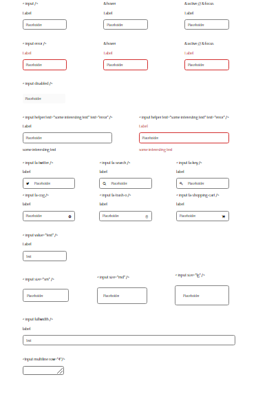

<!-- Please update value in the {}  -->

<h1 align="center">{inputs component}</h1>

<div align="center">
  <h3>
    <a href="https://adoring-roentgen-0c266f.netlify.app/">
      Demo
    </a>
    <span> | </span>
    <a href="https://github.com/starjardin/input-component">
      Solution
    </a>
  </h3>
</div>

<!-- TABLE OF CONTENTS -->

## Table of Contents

-   [Overview](#overview)
    -   [Built With](#built-with)
-   [Features](#features)
-   [How to use](#how-to-use)
-   [Contact](#contact)
-   [Acknowledgements](#acknowledgements)

<!-- OVERVIEW -->

## Overview


Introduce your projects by taking a screenshot or a gif. Try to tell visitors a story about your project by answering:


-   Hello wold, you can see my demo in this <a href="https://github.com/starjardin/input-component">solution</a> <a href="https://adoring-roentgen-0c266f.netlify.app/">Demo</a>
-   I think, it does not alway to set props in the app with dashes/underscores
-   I learned something indeed, such as setting an inside an input you need to add this link <link rel="stylesheet"href="https://cdnjs.cloudflare.com/ajax/libs/font-awesome/4.7.0/css/font-awesome.min.css"> to your html and use fa- as a prefix of your icons, loads of things I think I still need to work on such as passing the props to another file is still a little bit blury but with practice I think it will be fine
-   Your wisdom? :)

### Built With

<!-- This section should list any major frameworks that you built your project using. Here are a few examples.-->

-   [React](https://reactjs.org/)

## Features

<!-- List the features of your application or follow the template. Don't share the figma file here :) -->

## How To Use

<!-- Example:  -->

To clone and run this application, you'll need [Git](https://git-scm.com) and [Node.js](https://nodejs.org/en/download/) (which comes with [npm](http://npmjs.com)) installed on your computer. From your command line:

```bash
# Clone this repository
$ git clone https://github.com/your-user-name/your-project-name

# Install dependencies
$ npm install

# Run the app
$ npm start
```

## Acknowledgements

<!-- This section should list any articles or add-ons/plugins that helps you to complete the project. This is optional but it will help you in the future. For exmpale -->

-   [Node.js](https://nodejs.org/)
-   [Marked - a markdown parser](https://github.com/chjj/marked)

## Contact

-   Website [your-website.com](https://{your-web-site-link})
-   GitHub [@your-username](https://{github.com/your-usermame})
-   Twitter [@your-twitter](https://{twitter.com/your-username})
